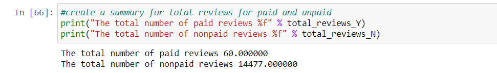
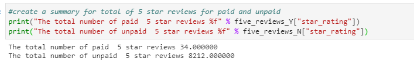
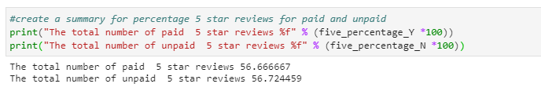

# Amazon_Vine_Analysis

## Overview of the Analysis

Analyzing Amazon reviews written by members of the paid Amazon Vine program. The Amazon Vine program is a service that allows manufacturers and publishers to receive reviews for their products. I had access to approximately 50 datasets, while I had trouble with the mobile applications reviews, I chose the musical instruments instead. We will analyze by using PySpark to perform ETL, connect to an AWS RDS instance and load the data into pgAdmin.

## Results

As seen from the images above there was a total of 60 paids review and 14477 non paid reviews
